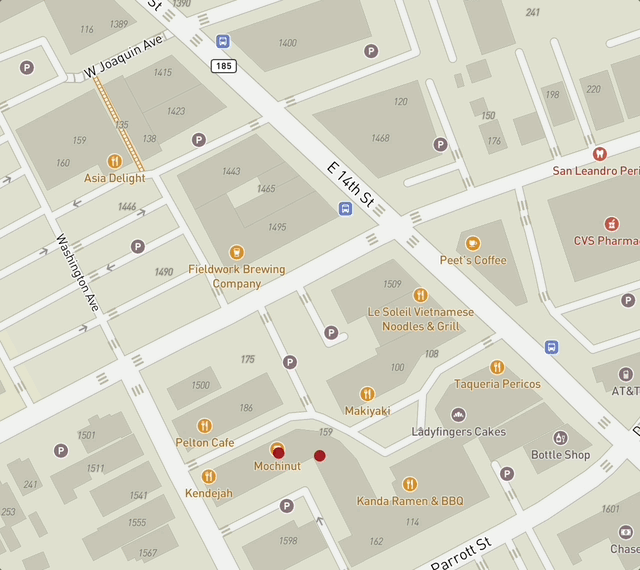

# "My favrotie places to eat "

)

## What did I build?

["My favorite places to eat" App](racoonhat1569.github.io/My-first-map-/)
Its a app based on places I like to eat on. Which is the San leandro are, these places are where me and my family like to get our favorite snacks. 

Here's a demo:

## Why did I build this?

I built this to show people the places I like to go after a long day. Im Also doing this so that people can go and enjoy these type of stuff. Its better for people to enjoy and be happy, than being a gatekeeper and selfish person.
## Tech stack

To build this app, I used the following tools:

1. [Google](https://www.google.com/maps/d/u/0/).

3. [Mapbox GL JS](https://docs.mapbox.com/mapbox-gl-js/guides) library, for styling and displaying maps and route lines, and adding camera behaviors (flyto animations).
4. [Visual Studio Code](https://code.visualstudio.com/download) free IDE, with [Live Server](https://marketplace.visualstudio.com/items?itemName=ritwickdey.LiveServer) and [Markdown All in One](https://marketplace.visualstudio.com/items?itemName=yzhang.markdown-all-in-one) extensions.
5. [GitHub pages](https://docs.github.com/en/pages/getting-started-with-github-pages/creating-a-github-pages-site), for publishing the app for free!

## Spotlight
A piece from my code is the longitude and lattitude which is the negative and positive. So what I did was having to go into google and search for the places I added in my map. So specifically saying going into the google maps website search the specific location of the places I added. I copied the coordinates/ longituted and lattitude and added them to the code of the map points. Puttin the negative ones first and the positive ones at the end. 
